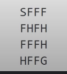
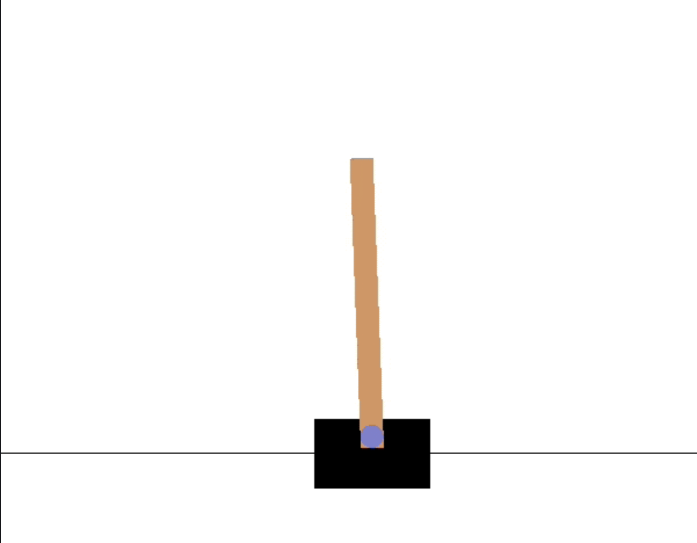
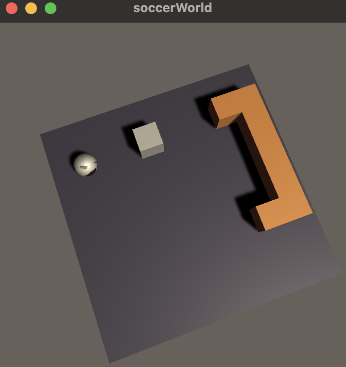

# Guide to Reinforcement Learning projects.
This repo has three projects that are highly commented for easy understanding. Also, appended with psuedocode wherever required!
# Projects
- Frozen Lake Problem from Open AI gym
- Cart Pole Problem from Open AI gym
- Goal2Ball Problem - Unity3d ML Agents - Environment coded from scratch in Unity3d

# Frozen Lake
- Agent has to learn to avoid pit represented as H and reach the goal G, solved using Q-Learning algorithm

# Cart Pole
- Env has cart and pole on a frictionless surface and the episode ends when the env reaches a certain goal points.

# Goal2Ball
- Thrilled by the projects in this domain, I wanted to develop a RL environment myself. Similar to the envs we see in Open AI Gym
- Fortunately, Unity 3d comes with ML agents where we can design and code an environment in C#
- Coded the behavior required, an episode ends if the balls falls of the platform/reaches the goal points/maximum steps reached.

